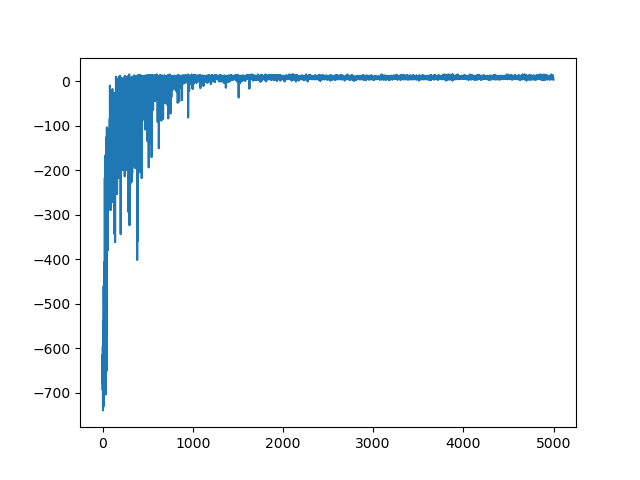

# 机器学习第六次作业报告

软73 沈冠霖 2017013569

## 1.基本情况

#### 1.1 运行环境

- windows 10
- python 3.7.1
- gym 0.17.3
- matplotlib 3.3.0
- numpy 1.19.1

#### 1.2 运行方法

我的代码运行在src文件夹下，先在src文件夹下输入如下指令安装依赖

```shell
pip install -r requirements.txt
```

我实现了主函数，运行在调试好的参数下，进行训练和测试。还实现了grid search代码，能够比较不同超参数下的运行结果，并且找到最优超参数组合。

运行三个算法的主函数：

```shell
python main.py --algorithm=QLearning
python main.py --algorithm=Sarsa
python main.py --algorithm=Sarsa_lambda
```

运行三个算法的grid search代码：

```shell
python grid_search.py --algorithm=QLearning
python grid_search.py --algorithm=Sarsa
python grid_search.py --algorithm=Sarsa_lambda
```

## 2.实验结果和分析

以下结果和分析都是在grid search的最优参数下测试得到

#### 2.1 训练结果

**QLearning：**


**Sarsa：**



**Sarsa_lambda:**


#### 2.2 测试结果

|                     | QLearning | Sarsa   | Sarsa_lambda |
| ------------------- | --------- | ------- | ------------ |
| **Average Reward**  | 7.873     | 7.395   | 7.222        |
| **Reward Variance** | 7.077     | 136.149 | 94.191       |
| **Average Steps**   | 13.127    | 13.542  | 13.736       |

#### 2.3 分析

首先分析训练情况：收敛性Sarsa>QLearning>Sarsa_lambda，Sarsa在1200个episode就基本收敛，而其他两个算法得到2000个episode才能收敛。同时，Sarsa的训练曲线在收敛后非常平稳，而QLearning就差一些，而Sarsa_lambda则不够平稳。

其次分析测试情况：三者的平均准确率和平均步长相差不多，可以认为效果近似。但是稳定性三者有着较为明显的差异：QLearning稳定性最好，Sarsa_lambda次之，Sarsa稳定性最差。

最后分析训练时间：QLearning和Sarsa的训练时间都很短，几秒就能训练5000个episode，而Sarsa_lambda需要每次都更新整个Q和E矩阵，速度很慢，训练5000个episode需要接近一小时。

综合分析三个算法，因为QLearning稳定性最高，而且训练较快，收敛性也不是很差，因此选用QLearning最佳。